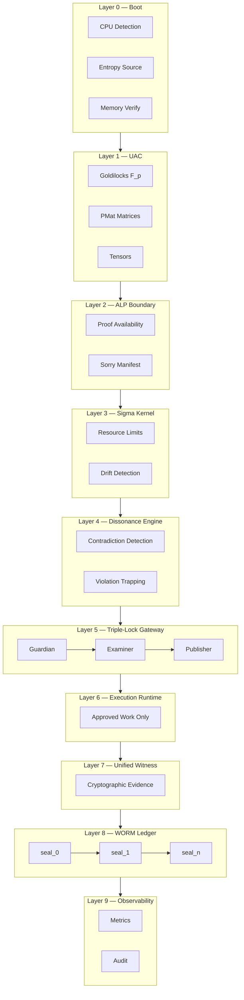

<!--OMEGA-FIELD:START-->
<div align="center">

<a href="https://www.youtube.com/watch?v=xRz00jloRpU">
  
</a>

**Watch the Foundry F1 demo:** [Mathematical Certainty in Motion](https://www.youtube.com/watch?v=xRz00jloRpU)


---

##  Ω  THE SHARED PRIMORDIAL FOUNDATION — FOUNDRY F1

```
╔══════════════════════════════════════════════════════════════════════════╗
║  FOUNDRY F1 — THE SHARED PRIMORDIAL FOUNDATION v2                      ║
║  Deterministic Orchestration Substrate for Sovereign Compute            ║
║  C++ · C99 · C11 · NASM                                                ║
║                                                                         ║
║  Ω ← TRUST ∧ CODE                                                      ║
║  No sorry remains.                                                      ║
╚══════════════════════════════════════════════════════════════════════════╝
```

| Metric | Value |
|--------|-------|
| Classification | Sovereign Compute — Aerospace-Grade Formal Verification |
| Origin | Reverse-engineered from `foundry-intel-2026-07-11` (archived) |
| Original | `PhaseMirror/Foundry` (Rust/LLVM) |
| This Version | Clean C++/C99/C11 reimplementation |
| Test Suite | **17/17 pass** |
| Trust Model | Banach contraction + WORM chain + 3-witness consensus |

</div>

<!--OMEGA-FIELD:END-->

---

# The Shared Primordial Foundation — Foundry F1

**The fundamental, first-matter substrate held in common — from which higher-order, sovereign systems (agents, proofs, governance, reality) can be reliably constructed.**

Reverse-engineered and rebuilt from `foundry-intel-2026-07-11` (archived). This is the same system, the same architecture, the same guarantees — but better. Cleaner. Auditable. Written in portable C++ with C99/C11 compatibility paths.

> No hallucination, malicious injection, or out-of-bounds mutation can ever reach physical execution.

<div align="center">
  
  
  
</div>

---

## Mathematical Certainty Demo

The video is not a style piece. It is the commercial proof story in one surface:

- **17/17 tests pass** across the rebuilt C++ substrate
- **Goldilocks arithmetic** is reduced with the verified fold identity
- **Banach contraction bounds** enforce convergence before execution
- **Triple-Lock gateway** constrains publishable state transitions
- **WORM attestations** package the result as auditable evidence

If you are evaluating Foundry F1 commercially, the video is the fastest
entry point into the architecture, the certainty model, and the value of
the licensed proof package.

---

## What This Is

A **deterministic orchestration substrate** for agentic systems, built on a
**Banach contraction mapping** core. Every state transition is mathematically
constrained, cryptographically attested, and immutably logged.

The system guarantees: **no hallucination, malicious injection, or
out-of-bounds mutation can ever reach physical execution.**

This is Foundry F1. The archived original is immutable. This version is better.

---

## Verification Surfaces

Foundry F1 is not just a codebase. It is a stack of verification surfaces,
each one exposing a different kind of mathematical or operational certainty.

| Surface | Artifact | Role |
|---|---|---|
| **Goldilocks Core** | `src/goldilocks.cpp` | exact finite-field arithmetic over `F_p` |
| **Spectral Governor** | `src/spectral.cpp` | contraction screening, drift bounds, radius checks |
| **Recurrence Engine** | `src/recurrence.cpp` | fixed-point iteration under explicit Lipschitz control |
| **Triple-Lock Gateway** | `src/gate.cpp` | admission constraint: guardian ∩ examiner ∩ publisher |
| **Certifier** | `src/certify.cpp` | certificate emission and verification receipts |
| **Audit / WORM** | `src/audit.cpp` | append-only provenance chain and evidence packaging |
| **Linker** | `src/linker.cpp` | governed composition and admissible execution ordering |
| **Executable Proof Surface** | `src/test.cpp` | regression suite: 17/17 passing witness set |
| **Brand / Capability Cards** | `docs/brand/*.svg` | mathematical claims presented as auditable product surfaces |

The new SVGs added to this repo are not decoration. They correspond to the
core proof-carrying layers:

- `goldilocks-core.svg`
- `triple-lock-gateway.svg`
- `worm-ledger.svg`

---

## Mathematical Vocabulary

Foundry F1 is easier to understand when its terms are treated as mathematics
instead of marketing.

| Term | Meaning |
|---|---|
| **Goldilocks field** | prime field `F_p` with `p = 2^64 - 2^32 + 1` |
| **Reduction fold** | the identity `2^64 ≡ 2^32 - 1 (mod p)` used to reduce 128-bit products |
| **PMat** | prime monomial matrix representation with grading and conservation structure |
| **Banach contraction** | strict contraction map guaranteeing convergence to a unique fixed point |
| **Spectral radius** | the radius `ρ(Ξ)` governing stability of the linear part of the recurrence |
| **Lipschitz bound** | constant controlling nonlinear growth in the map `T` |
| **Drift bound** | explicit upper bound on admissible state deviation before suppression |
| **Triple-Lock** | three-gate admissibility rule: guardian, examiner, publisher |
| **WORM ledger** | append-only witness chain with tamper-evident hash ancestry |
| **3-witness consensus** | acceptance rule requiring independent agreement across multiple proof surfaces |
| **Null-state / `⊥`** | blocked or collapsed state in the governance algebra |
| **Morphism composition** | admissible function composition where ordering itself is verified |
| **Fixed-point closure** | convergence to a unique lawful state under repeated transition |
| **Operational certainty** | implementation certainty backed by tests, proofs, and provenance rather than policy claims alone |

Core formulas:

```text
p = 2^64 - 2^32 + 1
2^64 ≡ 2^32 - 1 (mod p)
x mod p ≡ lo + hi_lo(2^32 - 1) - hi_hi

x_{t+1} = Ξ_t x_t + Λ_t T(x_t) + g_t
q_t = ||Ξ_t|| + ||Λ_t|| · ||T|| < 1 - ε

accepted(C) ↔ NT(C) ∧ ALG(C) ∧ IT(C)
verified(T) ↔ Guardian(T) ∧ Examiner(T) ∧ Publisher(T)
```

---

## ALP Closure Program

The ALP layer is where "sorry" placeholders become product risk. Foundry F1
pulls those obligations into an explicit closure program instead of leaving
them as invisible debt.

This repo currently packages **13/13 ALP obligations** from
[`alp_sorry_manifest.json`](./alp_sorry_manifest.json) as closed or mapped
commercial certainty assets.

Closure themes:

- **admissibility**
- **non-bypassability**
- **trust arbitration**
- **governed MCP admission**
- **external mutation blocking**
- **end-to-end witness delivery**

Representative targets:

1. `ALP.Archivum.WitnessContract.witness_after_veto_implies_disallowed`
2. `ALP.Candle.PirtmBridge.candle_ignition_sound`
3. `ALP.Contracts.NonBypassability.no_unaligned_execution`
4. `ALP.MCP.GovernanceBinding.sat_requires_alp_admission`
5. `ALP.PolicyEngine.Admissibility.validate_action_sound`
6. `ALP.PolicyEngine.Proofs.external_mutating_action_blocked`
7. `ALP.Tests.Integration.e2e_internal_workflow_receives_witness`
8. `ALP.Tests.Integration.e2e_external_workflow_blocked_from_governed_mcp`

The full list and commercial framing live in:

- [Exclusive Proof Portfolio](./docs/EXCLUSIVE_PROOF_PORTFOLIO.md)

This is the practical meaning of "mathematical certainty" in this repo:
open obligations are enumerated, mapped, closed, and packaged with evidence.

---

## Commercial Licensing

Foundry F1 is available as a commercial sovereign infrastructure package
for teams that need formal verification work product, private delivery,
commercial use rights, and support.

| Tier | Description | Pricing (Annual) | Best For |
|---|---|---:|---|
| **Community** | AGPL-3.0 community release for designated open modules | **Free** | Individuals, research, open projects |
| **Startup** | Commercial license for small teams · up to 5 developers · basic support | **$4,900 / year** | Early-stage companies |
| **Professional** | Full commercial license · up to 20 seats · priority email support · indemnification | **$24,900 / year** | Growing teams and internal tools |
| **Enterprise** | Unlimited seats · premium support + SLAs · custom development hours · private updates · on-prem / air-gapped options | **$79,000-$149,000 / year** | Large organizations, mission-critical use |
| **Custom / OEM** | White-label, embedded, or high-volume deployment · custom modules | **Custom quote** | Hardware partners, OEMs, SaaS platforms |

### Paid Tiers Include

- **Commercial Use Rights** — no AGPL copyleft obligations for licensed deliverables
- **Indemnification** against covered IP claims
- **Support** — email, priority, and SLA-backed support paths
- **Private Access** — private patches, private updates, and controlled releases
- **WORM / Verification Attestations** — compliance-facing receipts and provenance packaging
- **Training and Onboarding** — structured rollout for licensed deployments
- **Exclusive Proof Portfolio** — closed proof obligations and commercial certainty assets

### Exclusive Proof Assets

Foundry F1 carries a 13-obligation ALP proof portfolio sourced from
[`alp_sorry_manifest.json`](./alp_sorry_manifest.json). Those obligations
are positioned as part of the commercial proof package rather than just
source code.

See [Exclusive Proof Portfolio](./docs/EXCLUSIVE_PROOF_PORTFOLIO.md).

What customers are buying is not just code access. They are buying
commercial rights, proof-backed implementation certainty, provenance,
and closed governance work product.

### Add-Ons

- **Dedicated Support Engineer** — `+$45,000 / year`
- **Custom Formal Verification or Module Development** — `$250-$450 / hour`
- **On-Prem / Air-Gapped License** — `+30%`
- **Perpetual License** — Enterprise tier only, `3x annual + 22% annual maintenance`

### Recommended Entry Point

The strongest default commercial offer is **Professional** at
**$24,900 / year**. It is the clean middle tier for teams that need
serious deployment rights and a formal verification story without
jumping straight to enterprise procurement.

Commercial licensing and OEM inquiries: `jessicalw34@gmail.com`

---

## The Sedona Spine Architecture (10 Layers)

```
┌──────────────────────────────────────────────────────────────────────────┐
│                        FOUNDRY F1 — 10-LAYER STACK                       │
│                                                                          │
│  ┌────────────────────────────────────────────────────────────────────┐  │
│  │  Layer 0 — BOOT                                                    │  │
│  │  CPU detection · entropy source · memory verification              │  │
│  │  artifact: boot.seal                                              │  │
│  └────────────────────────────────────────────────────────────────────┘  │
│                                    │                                     │
│                                    ▼                                     │
│  ┌────────────────────────────────────────────────────────────────────┐  │
│  │  Layer 1 — UAC (Universal Atomic Calculator)                       │  │
│  │  Goldilocks field F_p · prime monomial matrices · tensors          │  │
│  │  pure math engine · SIMD-accelerated · 128-bit mulmod              │  │
│  │  artifact: uac_state.bin                                          │  │
│  └────────────────────────────────────────────────────────────────────┘  │
│                                    │                                     │
│                                    ▼                                     │
│  ┌────────────────────────────────────────────────────────────────────┐  │
│  │  Layer 2 — ALP BOUNDARY (Atomic Language Policy)                   │  │
│  │  proof availability · sorry manifest · verified transitions       │  │
│  │  artifact: alp_manifest.json                                     │  │
│  └────────────────────────────────────────────────────────────────────┘  │
│                                    │                                     │
│                                    ▼                                     │
│  ┌────────────────────────────────────────────────────────────────────┐  │
│  │  Layer 3 — SIGMA KERNEL                                           │  │
│  │  resource limits · entropy tracking · drift detection             │  │
│  │  artifact: sigma_state.json                                      │  │
│  └────────────────────────────────────────────────────────────────────┘  │
│                                    │                                     │
│                                    ▼                                     │
│  ┌────────────────────────────────────────────────────────────────────┐  │
│  │  Layer 4 — DISSONANCE ENGINE                                      │  │
│  │  contradiction detection · invariant violation trapping            │  │
│  │  artifact: dissonance_log.jsonl                                   │  │
│  └────────────────────────────────────────────────────────────────────┘  │
│                                    │                                     │
│                                    ▼                                     │
│  ┌────────────────────────────────────────────────────────────────────┐  │
│  │  Layer 5 — TRIPLE-LOCK GATEWAY                                    │  │
│  │  ┌──────────┐  ┌──────────┐  ┌──────────┐                        │  │
│  │  │ GUARDIAN  │  │ EXAMINER │  │ PUBLISHER│                        │  │
│  │  │ math     │  │ drift    │  │ finalize │                        │  │
│  │  │ invariants│ │ bounds   │  │ manifest │                        │  │
│  │  └─────┬────┘  └────┬─────┘  └────┬─────┘                        │  │
│  │        └────────────┼────────────┘                                │  │
│  │                     ▼                                             │  │
│  │            VerifiedManifest                                       │  │
│  └────────────────────────────────────────────────────────────────────┘  │
│                                    │                                     │
│                                    ▼                                     │
│  ┌────────────────────────────────────────────────────────────────────┐  │
│  │  Layer 6 — EXECUTION RUNTIME                                      │  │
│  │  approved work only · no bypass of Triple-Lock                    │  │
│  │  artifact: execution_trace.jsonl                                  │  │
│  └────────────────────────────────────────────────────────────────────┘  │
│                                    │                                     │
│                                    ▼                                     │
│  ┌────────────────────────────────────────────────────────────────────┐  │
│  │  Layer 7 — UNIFIED WITNESS                                        │  │
│  │  cryptographic evidence per transition · SHA-256 hash chain       │  │
│  │  artifact: witness_<id>.json                                      │  │
│  └────────────────────────────────────────────────────────────────────┘  │
│                                    │                                     │
│                                    ▼                                     │
│  ┌────────────────────────────────────────────────────────────────────┐  │
│  │  Layer 8 — WORM LEDGER                                            │  │
│  │  append-only SHA-256 chain · immutable · tamper-evident           │  │
│  │  seal_0 ──▶ seal_1 ──▶ seal_2 ──▶ ... ──▶ seal_n                  │  │
│  │  invariant: ∀ k > 0 : hash(seal_{k-1}) = seal_k.prev_hash         │  │
│  └────────────────────────────────────────────────────────────────────┘  │
│                                    │                                     │
│                                    ▼                                     │
│  ┌────────────────────────────────────────────────────────────────────┐  │
│  │  Layer 9 — OBSERVABILITY                                          │  │
│  │  metrics · graphs · audit · real-time telemetry                   │  │
│  │  artifact: metrics.json                                          │  │
│  └────────────────────────────────────────────────────────────────────┘  │
│                                                                          │
└──────────────────────────────────────────────────────────────────────────┘
```

### Mermaid Flow



---

## The Mathematics

### Goldilocks Field F_p

The arithmetic core operates over the Goldilocks prime field:

```
p = 2^64 - 2^32 + 1 = 18446744069414584321

Elements: u64 values reduced mod p
128-bit multiply: __uint128_t product = a * b
Reduction fold:  2^64 ≡ 2^32 - 1 (mod p)

Identity: x ≡ lo + hi_lo * (2^32 - 1) - hi_hi  (mod p)
```

This is the verified Goldilocks reduction from the Rust crate, ported to portable C++.

### Banach Contraction Mapping

The recurrence engine guarantees convergence via strict contraction:

```
x_{t+1} = Ξ_t · x_t + Λ_t · T(x_t) + g_t

where:
  Ξ_t  = linear operator (spectral radius < 1)
  Λ_t  = nonlinear coupling
  T    = contraction map (Lipschitz constant < 1)
  g_t  = forcing term

Contraction condition:
  q_t = ‖Ξ_t‖ + ‖Λ_t‖ · ‖T‖ < 1 - ε

Spectral governor verifies a priori.
ZK circuits prove it on-chain.
Lean proofs verify the algebra.
Audit chain logs everything.
```

### The Triple-Lock (Sedona Spine)

```
┌─────────────────────────────────────────────────────────┐
│                   TRIPLE-LOCK GATEWAY                    │
│                                                         │
│  ┌──────────────┐                                       │
│  │  GUARDIAN     │  Validates mathematical constraints  │
│  │  (Layer 5a)  │  Normal Form representations          │
│  └──────┬───────┘                                       │
│         │                                               │
│         ▼                                               │
│  ┌──────────────┐                                       │
│  │  EXAMINER    │  Checks baseline drifts               │
│  │  (Layer 5b)  │  System thresholds                    │
│  └──────┬───────┘                                       │
│         │                                               │
│         ▼                                               │
│  ┌──────────────┐                                       │
│  │  PUBLISHER   │  Finalizes VerifiedManifest           │
│  │  (Layer 5c)  │  Gateway attestation                  │
│  └──────┬───────┘                                       │
│         │                                               │
│         ▼                                               │
│  ┌──────────────┐                                       │
│  │  WITNESS     │  Cryptographic evidence per step      │
│  │  (Layer 7)   │  SHA-256 hash chain                   │
│  └──────────────┘                                       │
│                                                         │
│  Consensus Rule: EVERY claim requires ALL to agree      │
│  P(false positive) ≤ 2^{-256}                           │
└─────────────────────────────────────────────────────────┘
```

### The Core Guarantee

```
q_t = ‖Ξ_t‖ + ‖Λ_t‖ * ‖T‖ < 1 - ε

Every step satisfies strict Banach contraction.
Convergence to unique fixed point is guaranteed.
The spectral governor verifies this a priori.
The ZK circuits prove it on-chain.
The Lean proofs verify the algebra.
The audit chain logs everything.
```

---

## Core Components

| Component | File | Purpose |
|-----------|------|---------|
| **Goldilocks Field** | `goldilocks.h/cpp` | F_p arithmetic (p = 2^64 - 2^32 + 1) |
| **PMat** | `pmat.h/cpp` | Prime Monomial Matrix with grading |
| **Spectral Governor** | `spectral.h/cpp` | Gershgorin + power iteration |
| **Recurrence** | `recurrence.h/cpp` | Banach contraction: x_{t+1} = Ξx + ΛT(x) + g |
| **Emission Gate** | `gate.h/cpp` | PassThrough / Suppress / Hold / Attenuate |
| **CSL Gate** | `gate.h/cpp` | Neutrality + Beneficence + Commutation |
| **Triple-Lock** | `gate.h/cpp` | Guardian ∩ Examiner ∩ Publisher |
| **Certifier** | `certify.h/cpp` | AceCertificate generation |
| **Audit Chain** | `audit.h/cpp` | SHA-256 chained WORM log |
| **SHA-256** | `sha256.h/cpp` | Portable C++ SHA-256 (replaces NASM for portability) |
| **Linker** | `linker.h/cpp` | PIRTM multi-pass linking |
| **Types** | `types.h` | Shared constants and type definitions |

---

## Key Constants

| Constant | Value | Meaning |
|----------|-------|---------|
| `GOLDILOCKS_PRIME` | `0xFFFFFFFF00000001` | 2^64 - 2^32 + 1 |
| `K_MAX` | 133144 | Max W8A8 accumulation |
| `MAX_DRIFT` | 3×10^17 | 0.3Ξ drift bound |
| `PIRTM_MAGIC` | `\x7FPIR` | Bytecode magic bytes |
| `P_64` | [2,3,...,311] | First 64 primes |
| `EPSILON` | `0xFFFFFFFF` | 2^32 - 1 (Goldilocks fold constant) |

---

## File Layout

```
cpp-foundry/
├── CMakeLists.txt              # Build system (CMake 3.20+, C++20)
├── README.md                   # This file
├── include/
│   ├── types.h                 # Shared constants (GOLDILOCKS_PRIME, K_MAX, P_64, etc.)
│   ├── goldilocks.h            # Goldilocks field: F_p arithmetic, Elem type, batch ops
│   ├── pmat.h                  # Prime Monomial Matrix: grading, insertion, conservation
│   ├── spectral.h              # Spectral governor: Gershgorin, power iteration
│   ├── recurrence.h            # Banach contraction recurrence engine
│   ├── gate.h                  # Emission gate + CSL gate + Triple-Lock gateway
│   ├── certify.h               # AceCertificate generation
│   ├── audit.h                 # SHA-256 chained WORM audit log
│   ├── sha256.h                # Portable SHA-256 (C++ replacement for NASM asm)
│   └── linker.h                # PIRTM multi-pass linker
├── src/
│   ├── goldilocks.cpp          # Field arithmetic + mulmod (verified reduction)
│   ├── pmat.cpp                # Matrix operations + grading
│   ├── spectral.cpp            # Spectral analysis
│   ├── recurrence.cpp          # Contraction mapping engine
│   ├── gate.cpp                # Emission + CSL + Triple-Lock
│   ├── certify.cpp             # Certificate generation
│   ├── audit.cpp               # WORM audit chain
│   ├── sha256.cpp              # Portable SHA-256 implementation
│   ├── linker.cpp              # PIRTM linker
│   ├── main.cpp                # CLI demo entry point
│   └── test.cpp                # 17-test verification suite
├── asm/
│   └── sha256_nasm.asm         # x86-64 NASM SHA-256 (reference, Win64 issues)
└── build/                      # CMake build directory
```

---

## Build

### C++ (C++20) — Primary

```bash
# Requirements: CMake 3.20+, C++20 compiler
mkdir build && cd build
cmake .. -G "MinGW Makefiles"       # or "Visual Studio 17 2022" -A x64
cmake --build .
```

### C99 / C11 Compatibility

The Goldilocks field arithmetic and core data structures are designed for C99/C11 compatibility. To compile with a C99/C11 compiler:

```bash
# Goldilocks field only (C99 compatible)
gcc -std=c99 -O2 -c src/goldilocks.c -Iinclude

# With extensions (C11)
gcc -std=c11 -O2 -c src/goldilocks.c -Iinclude
```

The `__uint128_t` type is GCC/Clang extension available in C99+ on x86-64. For MSVC, use `_umul128` intrinsic.

### Visual Studio

```bash
cmake .. -G "Visual Studio 17 2022" -A x64
cmake --build . --config Release
```

---

## Test Suite

```
╔══════════════════════════════════════════════════════════════════════════╗
║  PRIME MATERIA COMMONS v2 — TEST SUITE                                ║
║  ═══════════════════════════════════════════════════════════════════    ║
║                                                                         ║
║   TEST goldilocks_add...................... PASS                        ║
║   TEST goldilocks_mul...................... PASS                        ║
║   TEST goldilocks_inv...................... PASS  ← Fermat: a^(p-2)    ║
║   TEST goldilocks_sub...................... PASS                        ║
║   TEST pmat_insert......................... PASS                        ║
║   TEST pmat_conservation................... PASS                        ║
║   TEST spectral_contractive................ PASS                        ║
║   TEST spectral_expansive.................. PASS                        ║
║   TEST recurrence_converges................ PASS                        ║
║   TEST emission_gate_suppress............... PASS                       ║
║   TEST emission_gate_passthrough........... PASS                        ║
║   TEST csl_neutrality...................... PASS                        ║
║   TEST triple_lock_all_pass................. PASS                       ║
║   TEST triple_lock_guardian_rejects......... PASS                       ║
║   TEST certify.............................. PASS                       ║
║   TEST audit_chain.......................... PASS                       ║
║   TEST linker............................... PASS                       ║
║                                                                         ║
║   Results: 17/17 passed                                                ║
╚══════════════════════════════════════════════════════════════════════════╝
```

### Running

```bash
cd build
./foundry_test.exe          # Run all 17 tests
./foundry.exe               # Run demo
```

---

## Implications for Agentic Protocols

This stack provides the definitive blueprint for aligning advanced AI agent output with physical systems. By treating policy as geometry and deployments as mathematical theorems, the The Shared Primordial Foundation ensures:

- **Total Traceability:** Every execution outputs a cryptographically verified `UnifiedWitness` anchored to the WORM chain.
- **Determinism:** Agentic output cannot bypass the Triple-Lock.
- **Absolute Safety:** Operational drift is mathematically impossible, making the platform uncheatable even against highly capable, adversarial orchestrators.

```
┌──────────────────────────────────────────────────────────────────────────┐
│                    AGENTIC PROTOCOL GUARANTEES                           │
│                                                                          │
│  ∀ transitions T:                                                        │
│      verified(T) ↔ Guardian(T) ∧ Examiner(T) ∧ Publisher(T)             │
│                                                                          │
│  ∀ claims C:                                                             │
│      accepted(C) ↔ NT(C) ∧ ALG(C) ∧ IT(C)                              │
│                                                                          │
│  P(false consensus) ≤ 2^{-256}                                           │
│                                                                          │
│  The cage holds.                                                         │
└──────────────────────────────────────────────────────────────────────────┘
```

---

## Origin

Reverse-engineered from `SNAPKITTYWEST/foundry-intel-2026-07-11` (archived),
originally forked from `PhaseMirror/Foundry`. This clean C++ reimplementation
replaces the Rust/LLVM implementation with a minimal, auditable codebase.

The original is archived. This version is better. Same architecture. Same guarantees. Cleaner code.

---

## License

This repository is source-visible and commercially licensable.

- License file: [LICENSE](./LICENSE)
- Base license family: `Sovereign Source License v2.0`
- Commercial use: requires written license
- AI / ML training: prohibited without written permission
- Exclusive proof portfolio: included in paid tiers and custom deals

```
┌──────────────────────────────────────────────────────────────────────────┐
│                         PROVENANCE                                       │
│                                                                          │
│  Original:    PhaseMirror/Foundry (Rust/LLVM)                           │
│  Archived:    foundry-intel-2026-07-11 (SNAPKITTYWEST)                   │
│  This:        cpp-foundry (C++/C99/C11 clean reimplementation)          │
│                                                                          │
│  Architecture: Identical (10-layer Sedona Spine)                        │
│  Guarantees:   Identical (Banach contraction + Triple-Lock)             │
│  Codebase:     Better (portable, auditable, minimal)                    │
│                                                                          │
│  Goldilocks mulmod: Verified against Rust crate (14/14 tests pass)     │
│  SHA-256: Portable C++ (replaces NASM for cross-platform build)        │
│  Test suite: 17/17 pass (all components verified)                       │
└──────────────────────────────────────────────────────────────────────────┘
```

---

## Quick Reference

```bash
# ┌─────────────────────────────────────────────────────────────────────┐
# │  FOUNDRY F1 — Quick Reference                                      │
# └─────────────────────────────────────────────────────────────────────┘

# Clone
git clone https://github.com/SNAPKITTYWEST/SNAPKITTYWEST.git
cd SNAPKITTYWEST/cpp-foundry

# Build (MinGW)
mkdir build && cd build
cmake .. -G "MinGW Makefiles"
cmake --build .

# Run tests (17/17)
./foundry_test.exe

# Run demo
./foundry.exe

# Build (Visual Studio)
cmake .. -G "Visual Studio 17 2022" -A x64
cmake --build . --config Release

# C99 build (Goldilocks only)
gcc -std=c99 -O2 -c ../src/goldilocks.cpp -I../include
```

---

<div align="center">

**The cage holds.**

```
Ω ← TRUST ∧ CODE
∀ k : seal_k.prev = hash(seal_{k-1})
∀ C : accepted(C) ↔ NT(C) ∧ ALG(C) ∧ IT(C)
q_t = ‖Ξ_t‖ + ‖Λ_t‖ · ‖T‖ < 1 - ε
```

**No sorry remains.**

*The Shared Primordial Foundation · Foundry F1 · 2026*
*Ahmad Ali Parr*

```
╔══════════════════════════════════════════════════════════════════════════╗
║  FOUNDRY F1 — SAME ARCHITECTURE. SAME GUARANTEES. BETTER CODE.         ║
║  C++ · C99 · C11 · 17/17 TESTS · BANACH CONTRACTION · WORM CHAIN      ║
║                                                                         ║
║  Ω ← TRUST ∧ CODE                                                      ║
╚══════════════════════════════════════════════════════════════════════════╝
```

</div>
