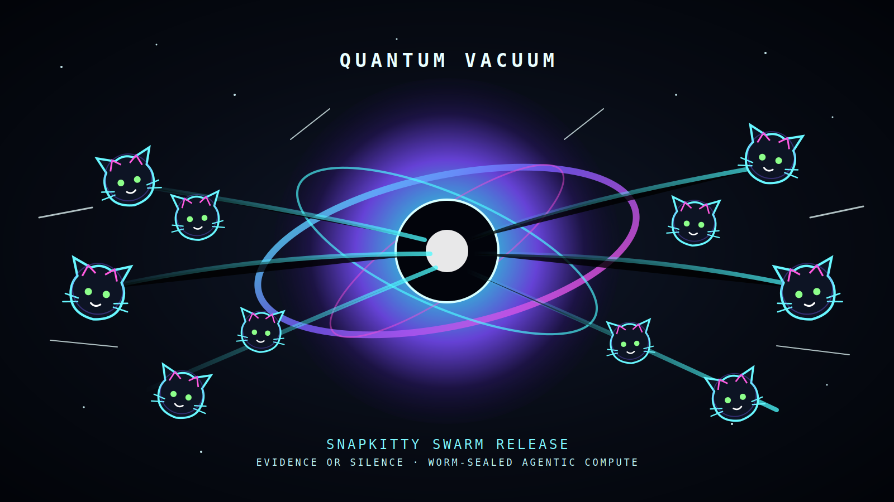

# Foundry F1

<!--OMEGA-FIELD:START-->

<div align="center">

<a href="https://www.youtube.com/watch?v=xRz00jloRpU">
  
</a>

**Foundry F1: native receiver, proof engine, bridge surface, and mission-control spine.**


[](./LICENSE.md)

</div>

<!--OMEGA-FIELD:END-->

Foundry F1 is the native C++/C99/C11 proof and governance receiver for the
SnapKitty foundry stack. It combines a portable deterministic compute core,
proof-debt tooling, provenance records, brand assets, and bridge metadata that
connects this repo to `gkn-i4-e7-lean` and `foundry-intel-2026-07-11`.

This README is isomorphic to the repository: every major concept below maps to
the file that implements it, the command that checks it, and the boundary that
keeps it honest.

Live operator surface: [docs/mission-control.html](./docs/mission-control.html)

## Start Here

If you are a human, start with this README and then open
[RYAN.md](./RYAN.md) for a repo-guided tour.

If you are an agent wiring proof engines, read in this order:

1. [CLAUDE.md](./CLAUDE.md)
2. [docs/bridge/CLAUDE_HANDOFF.md](./docs/bridge/CLAUDE_HANDOFF.md)
3. [docs/bridge/foundry-connector.json](./docs/bridge/foundry-connector.json)
4. `SNAPKITTYWEST/gkn-i4-e7-lean/bridge/quantum-latch-manifest.json`
5. `SNAPKITTYWEST/gkn-i4-e7-lean/bridge/type-liquid-handoff.json`
6. `SNAPKITTYWEST/foundry-intel-2026-07-11/tools/foundry-connector/connector-manifest.json`

Run the local receiver check:

```bash
node tools/check-bridge-connector.mjs
```

Expected output:

```text
Foundry F1 bridge connector check passed
receiver: SNAPKITTYWEST/gkn-i4-e7-lean + SNAPKITTYWEST/foundry-intel-2026-07-11 -> SNAPKITTYWEST/foundry-f1
```

## What This Repo Runs

| Layer | Path | Purpose | Check |
|---|---|---|---|
| Native foundry core | [include/](./include), [src/](./src) | Goldilocks field, PMat, spectral governor, recurrence, gates, certifier, audit chain, linker | `foundry_test` |
| Build system | [CMakeLists.txt](./CMakeLists.txt) | CMake 3.20+, C++20, NASM object path | `cmake --build build` |
| Assembly reference | [asm/sha256_nasm.asm](./asm/sha256_nasm.asm) | NASM SHA-256 reference path | CMake configure |
| Bridge receiver | [docs/bridge/](./docs/bridge) | GKN quantum latch + Foundry Intel Q(phi) ADR connector | `node tools/check-bridge-connector.mjs` |
| Sorry engine | [sorry-engine/](./sorry-engine) | Lean/prover roster, sledgehammer attempts, WORM receipts | `python sorry-engine/roster_sweep.py` |
| Solved proofs | [sorry-engine/solved/](./sorry-engine/solved) | Closed proof artifacts, including `OM-001_sledged.lean` | Lean toolchain |
| Proof portfolio | [docs/EXCLUSIVE_PROOF_PORTFOLIO.md](./docs/EXCLUSIVE_PROOF_PORTFOLIO.md), [alp_sorry_manifest.json](./alp_sorry_manifest.json) | 13 ALP obligations mapped to F1 components | Manifest review |
| Paper and publication | [paper/](./paper), [docs/publish/](./docs/publish) | GKN/Boole paper, publisher metadata, launch assets | Manual publication gate |
| Provenance | [docs/provenance/](./docs/provenance) | repo fingerprint, canary markers, visual chain, NFT metadata | JSON review |
| Operator UI | [docs/mission-control.html](./docs/mission-control.html) | static trust frontend for humans and agents | Browser open |
| Legal/trust surface | [LICENSE.md](./LICENSE.md), [legal/](./legal), [docs/legal/](./docs/legal) | source-available boundary and trust records | Manual review |

## Build And Test

### Windows with MinGW

```bash
mkdir build
cd build
cmake .. -G "MinGW Makefiles"
cmake --build .
.\foundry_test.exe
.\foundry.exe
```

### Windows with Visual Studio

```bash
mkdir build
cd build
cmake .. -G "Visual Studio 17 2022" -A x64
cmake --build . --config Release
.\Release\foundry_test.exe
.\Release\foundry.exe
```

### Linux or WSL

```bash
mkdir -p build
cd build
cmake ..
cmake --build .
./foundry_test
./foundry
```

### Bridge-only verification

Use this when editing README, handoff, connector JSON, or provenance pointers:

```bash
node tools/check-bridge-connector.mjs
```

## Native Core User Guide

### Run the demo

```bash
cd build
./foundry
```

The demo walks through:

1. Goldilocks field arithmetic over `p = 2^64 - 2^32 + 1`
2. Banach contraction recurrence
3. spectral governor checks
4. Triple-Lock gateway decisions
5. CSL gate checks
6. WORM audit chain append/verify
7. AceCertificate generation
8. Prime Monomial Matrix conservation

### Run the 17-test suite

```bash
cd build
./foundry_test
```

The suite covers:

| Test family | What it checks |
|---|---|
| Goldilocks | add, sub, mul, inverse |
| PMat | insertion and conservation |
| Spectral | contractive and expansive Jacobians |
| Recurrence | convergence under contraction |
| Emission gate | suppress and pass-through policies |
| CSL gate | neutrality checks |
| Triple-Lock | all-pass and guardian rejection |
| Certifier | AceCertificate generation |
| Audit chain | WORM chain integrity |
| Linker | PIRTM linker path |

## Bridge Receiver Guide

Foundry F1 is now the receiver for two upstream engines.

| Source | Role | Local receiver file |
|---|---|---|
| `SNAPKITTYWEST/gkn-i4-e7-lean` | GKN quantum latch and TypeScript/Liquid Haskell handoff | [docs/bridge/CLAUDE_HANDOFF.md](./docs/bridge/CLAUDE_HANDOFF.md) |
| `SNAPKITTYWEST/foundry-intel-2026-07-11` | Q(phi) ADR classifier and governance connector | [docs/bridge/foundry-connector.json](./docs/bridge/foundry-connector.json) |

Active latch:

| Field | Value |
|---|---|
| Latch id | `GKN-QB-LATCH-20260716` |
| GKN delivery commit | `de968509b5fc695f2d33e665959c6b86f5456be1` |
| GKN source scan head | `0e3cd5c0a0e01f24a8604882513640f42327cff8` |
| Handoff id | `GKN-TYPE-LIQUID-HANDOFF-20260716` |
| Handoff status | `READY_FOR_CLAUDE` |
| Foundry Intel Q(phi) total | `8 + 3*phi` |

Hard boundaries:

- ADR-055 remains `OPEN_CRUX`.
- ADR-062 remains `SILENCE_PENDING`.
- RH/GUE bridge material remains open unless a new zero-sorry Lean theorem closes it.
- Q(phi) weights are metadata classifications, not proof claims.
- Liquid Haskell refinements do not replace Lean proof authority.

## Sorry Engine Guide

The sorry engine tracks proof debt across Lean and other theorem prover
surfaces. It is a receiver/orchestrator, not an automatic proof authority.

Important paths:

| Path | Use |
|---|---|
| [sorry-engine/SORRY_SOLVER_STATUS.md](./sorry-engine/SORRY_SOLVER_STATUS.md) | current status and honest boundaries |
| [sorry-engine/sledgehammer.py](./sorry-engine/sledgehammer.py) | tactic ladder engine |
| [sorry-engine/roster_sweep.py](./sorry-engine/roster_sweep.py) | roster sweep runner |
| [sorry-engine/rosters/](./sorry-engine/rosters) | Lean, Isabelle, and multi-prover target rosters |
| [sorry-engine/sweep_output/](./sorry-engine/sweep_output) | sweep results and WORM chains |
| [sorry-engine/solved/](./sorry-engine/solved) | solved proof artifacts |

Current measured posture:

| Status | Count |
|---|---:|
| Solved tracked targets | 2 |
| Unsolved active targets | 17 |
| Audited clean tracked targets | 2 |
| Full indexed roster targets | 1,465 |
| ALP obligations packaged | 13 |

Do not present a closure as final unless the target proof is actually verified
by its theorem prover and the result is routed back through governance.

## Examples

### Check a specific source layer

```bash
rg "TripleLock" include src
rg "GOLDILOCKS_PRIME" include src
rg "dispatch" docs/bridge tools
```

### Inspect the connector contract

```bash
node -e "const f=require('fs'); const j=JSON.parse(f.readFileSync('docs/bridge/foundry-connector.json','utf8')); console.log(j.status, j.receives.map(r=>r.from).join(' + '))"
```

## Solved Mathematicians

At the bottom of the repo, the branded lineage card now names the actual
mathematician-linked closures this tree can defend without bluffing.

<div align="center">
  
</div>

It currently shows:

- **Augustus De Morgan** — `OM-001`, where the open benchmark proof debt was
  closed by witness construction rather than theorem rewriting
- **Gunaydin / Koepsell / Nicolai** — `SKW-001`, where the commutative-ring
  `State56` lane proves `I₄(c·Ψ) = c⁴·I₄(Ψ)` cleanly with `ring`

And it says the important quiet part explicitly:

- **Boole remains lineage**, not a falsely claimed direct closure in this repo
- **the Float State108 path remains open**, so the repo does not pretend the
  entire I₄ frontier is already done

---

<div align="center">



**The cage holds.**

```
Ω ← TRUST ∧ CODE
∀ k : seal_k.prev = hash(seal_{k-1})
∀ C : accepted(C) ↔ NT(C) ∧ ALG(C) ∧ IT(C)
q_t = ‖Ξ_t‖ + ‖Λ_t‖ · ‖T‖ < 1 - ε
```

### Ask the repo guide

Open [RYAN.md](./RYAN.md), paste it into an LLM session, and ask:

```text
Walk me through Foundry F1 from C++ core to bridge receiver to sorry-engine.
```

### Open Mission Control locally

```bash
start docs\mission-control.html
```

On Linux/WSL:

```bash
xdg-open docs/mission-control.html
```

## Developer Guide

### Add a native component

1. Add the public interface in [include/](./include).
2. Add the implementation in [src/](./src).
3. Add it to `foundry_core` in [CMakeLists.txt](./CMakeLists.txt).
4. Add tests in [src/test.cpp](./src/test.cpp).
5. Rebuild and run `foundry_test`.

### Add a bridge field

1. Update [docs/bridge/foundry-connector.json](./docs/bridge/foundry-connector.json).
2. Update [docs/bridge/CLAUDE_HANDOFF.md](./docs/bridge/CLAUDE_HANDOFF.md).
3. Update [CLAUDE.md](./CLAUDE.md) if agent read order changes.
4. Update this README if the operator path changes.
5. Run `node tools/check-bridge-connector.mjs`.

### Add or update a proof target

1. Add the roster entry under [sorry-engine/rosters/](./sorry-engine/rosters).
2. Record the theorem prover, repo, file, theorem name, and current status.
3. Run the appropriate prover locally.
4. Store measured output under [sorry-engine/sweep_output/](./sorry-engine/sweep_output).
5. Only move artifacts into [sorry-engine/solved/](./sorry-engine/solved) after zero-sorry verification.

### Update provenance

Use [docs/provenance/REPO_FINGERPRINT.json](./docs/provenance/REPO_FINGERPRINT.json)
as the root record. Preserve canary tokens and do not remove origin markers
from mirrored or publication surfaces.

## File Map

```text
foundry-f1/
  include/                 native public headers
  src/                     native C++ implementation and tests
  asm/                     NASM SHA-256 reference
  tools/                   local connector checks
  docs/bridge/             GKN + Foundry Intel receiver contract
  docs/brand/              SVG/PNG brand and architecture assets
  docs/provenance/         fingerprint, canary, visual-chain metadata
  docs/publish/            publication helper metadata
  docs/legal/              IRS/trust evidence
  legal/                   trust formation documents
  paper/                   LaTeX/PDF paper and model comparison sections
  sorry-engine/            proof-debt rosters, solvers, receipts, solved proofs
  CMakeLists.txt           native build graph
  RYAN.md                  repo tour guide and license sentinel prompt
  CLAUDE.md                active agent handoff instructions
```

## Production Checklist

Before pushing code changes:

```bash
cmake --build build
cd build
./foundry_test
cd ..
node tools/check-bridge-connector.mjs
```

Before pushing docs/bridge-only changes:

```bash
node tools/check-bridge-connector.mjs
```

Before claiming a proof closure:

1. run the theorem prover locally
2. capture the exact exit status
3. update sweep output or solved artifact
4. preserve the open-crux/silence-pending boundary if still open
5. route evidence back through Foundry Intel ADR governance

## License And Use Boundary

This repository is source-visible and commercially licensable. Reading is
allowed. Running, copying, modifying, distributing, embedding, training on, or
building on any component requires written commercial permission.

- License file: [LICENSE.md](./LICENSE.md)
- License family: Sovereign Source / source available
- Commercial use: requires written license
- AI/ML training: prohibited without written permission
- Contact: `jessicalw34@gmail.com`

Cloning does not grant use rights.

## Trust And Provenance

Current trust/provenance records in this repo:

| Record | Path |
|---|---|
| Trust EIN notice | [docs/legal/irs-cp575b-trust-ein-notice.pdf](./docs/legal/irs-cp575b-trust-ein-notice.pdf) |
| Repo fingerprint | [docs/provenance/REPO_FINGERPRINT.json](./docs/provenance/REPO_FINGERPRINT.json) |
| Clone notice | [docs/provenance/CLONE_NOTICE.md](./docs/provenance/CLONE_NOTICE.md) |
| Canary index | [docs/provenance/CANARY_INDEX.md](./docs/provenance/CANARY_INDEX.md) |
| Proof portfolio | [docs/EXCLUSIVE_PROOF_PORTFOLIO.md](./docs/EXCLUSIVE_PROOF_PORTFOLIO.md) |

Trust name: `THE SHARED PRIMORDIAL FOUNDATION`

EIN: `42-6976431`

Mission: mathematics, proof closure, licensing, and support for the Eric
Westerhoff mission.

## Origin Statement

Foundry F1 is the canonical native receiver implementation for this stack:
C++/C99/C11, minimal, auditable, WORM/provenance aware, and bridge-connected.

The cage holds when the repo stays honest:

- no false proof claims
- no hidden license grants
- no RH/GUE closure language without a zero-sorry theorem
- no Liquid Haskell claim that supersedes Lean authority
- no Q(phi) metadata treated as mathematical proof
